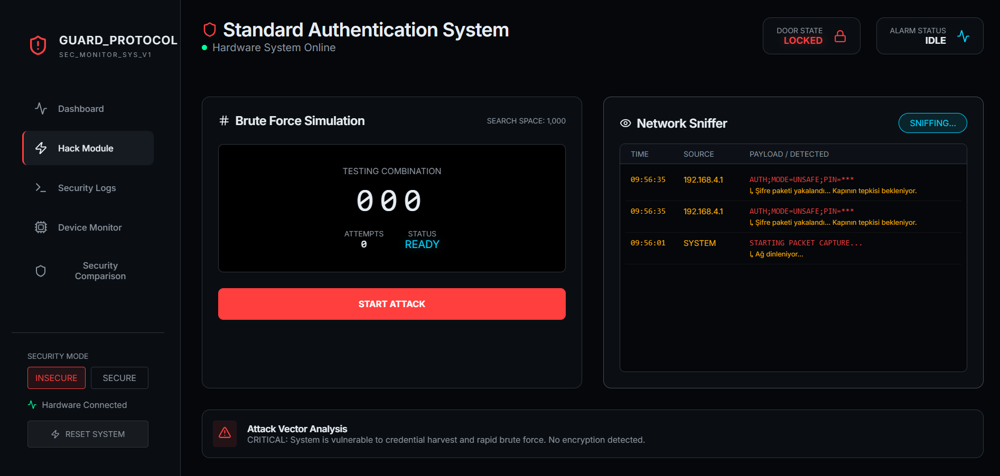

# IoT Secure Access Control and Attack Simulation Testbed

An educational IoT security testbed that demonstrates how a Wi-Fi based smart door system can fail under weak authentication, plaintext traffic, and missing rate limits, then shows how layered controls reduce the same risks.

The platform uses two ESP32 boards, a Node.js backend, and a React SOC-style dashboard to compare an insecure access-control design against a more defensive mode with MFA, PIN masking, lockout, and real-time monitoring.

> This project is built for academic demonstration and controlled lab use only. Do not use the attack simulation components against systems you do not own or have explicit permission to test.

## Highlights

- Two ESP32 devices communicate over Wi-Fi with TCP sockets.
- The panel ESP32 handles keypad input and sends authentication commands.
- The door ESP32 controls the servo lock, RFID reader, buzzer, LEDs, lockout, and telemetry.
- A Node.js backend parses live device traffic and exposes events to the dashboard.
- A React dashboard visualizes access attempts, sniffed packets, brute-force simulation, device state, and security logs.
- The same hardware can be switched between vulnerable and defensive operating modes.

## System Architecture


## Operating Modes

| Capability | Insecure Mode | Secure Mode |
| --- | --- | --- |
| PIN length | 3 numeric digits | 9 numeric digits |
| Authentication factors | PIN only | PIN + RFID card |
| Network visibility | PIN is sent as plaintext | PIN is XOR-masked before transmission |
| Brute-force defense | No lockout | 3 failed attempts trigger lockout/alarm |
| Monitoring | Logs access attempts | Logs access attempts, lockout, and suspicious activity |

Note: XOR masking is intentionally simple for classroom demonstration. A production-grade system should use authenticated encryption, key management, replay protection, and TLS or an equivalent secure transport.

## Repository Layout

```text
.
├── backend/                 # Node.js API, TCP client, parser, Socket.IO events
├── dashboard/               # React + Vite SOC dashboard
├── firmware/
│   ├── door-esp32/          # Door controller firmware
│   └── panel-esp32/         # Keypad panel firmware
├── docs/                    # Architecture and scenario documentation
└── media/                   # Poster and project photos/screenshots
```

## Hardware

- 2x ESP32 development boards
- Matrix keypad
- I2C LCD
- SG90 or compatible servo motor
- MFRC522 RFID reader
- RFID card/tag
- Buzzer
- Red/green LEDs
- Jumper wires and breadboard/prototype board

See [docs/hardware.md](docs/hardware.md) for pin mapping and board notes.

## Firmware Setup

1. Open `firmware/door-esp32/door-esp32.ino` in Arduino IDE.
2. Replace these placeholders:
   - `CHANGE_ME_DOOR_AP_SSID`
   - `CHANGE_ME_DOOR_AP_PASSWORD`
   - `CHANGE_ME_RFID_UID`
3. Upload the door firmware to the door ESP32.
4. Open `firmware/panel-esp32/panel-esp32.ino`.
5. Use the same Wi-Fi SSID and password placeholders as the door firmware.
6. Upload the panel firmware to the panel ESP32.

## Backend Setup

```bash
cd backend
npm install
copy .env.example .env
npm start
```

Configure `.env`:

```env
PORT=5001
TARGET_IP=192.168.4.1
TARGET_PORT=81
SIMULATION_MODE=false
```

Use `SIMULATION_MODE=true` to test the dashboard without hardware.

## Dashboard Setup

```bash
cd dashboard
npm install
npm run dev
```

The dashboard expects the backend to run at `http://localhost:5001`.

## Demo Assets

- Project poster: [media/poster/graduation-project-poster.pdf](media/poster/graduation-project-poster.pdf)
- Photos and screenshots: [media/photos](media/photos)

Example project media:



## Security Lessons Demonstrated

- Short numeric PINs are not suitable as a single factor for physical access control.
- Plaintext IoT traffic can expose credentials to passive network monitoring.
- Rate limiting and lockout rules can drastically reduce brute-force feasibility.
- MFA increases resilience when one credential factor is exposed.
- Monitoring and logs help make attacks visible instead of silent.

## Documentation

- [Architecture](docs/architecture.md)
- [Attack and Defense Scenarios](docs/attack-defense-scenarios.md)
- [Hardware Notes](docs/hardware.md)

## Academic Context

Project name: **IoT-Based Secure Access Control and Attack Simulation Platform**

This work was developed as a graduation project to compare vulnerable and hardened IoT access-control designs with real hardware, real-time logs, and an interactive security dashboard.
