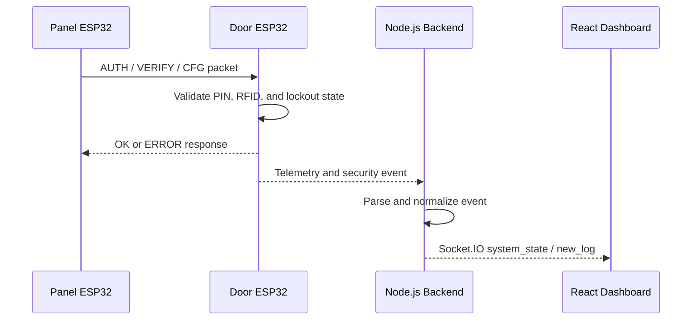

# Architecture

The project is organized as a small cyber security testbed with three layers: physical devices, backend telemetry processing, and a real-time monitoring dashboard.

## Physical Layer

The physical layer contains two ESP32 boards:

- **Panel ESP32:** reads keypad input, displays UI messages on the LCD, and sends authentication/configuration packets to the door controller.
- **Door ESP32:** hosts the Wi-Fi access point, receives authentication packets, checks PIN/RFID state, drives the servo lock, and emits telemetry.

The devices communicate with TCP sockets over the door ESP32 access point.

## Backend Layer

The Node.js backend connects to the door controller monitor socket and parses hardware messages. It keeps a normalized system state and broadcasts updates through Socket.IO.

Main responsibilities:

- connection management
- command forwarding
- event parsing
- state synchronization
- REST endpoints for dashboard actions
- real-time event delivery

## Dashboard Layer

The React dashboard acts as a SOC-style monitoring interface. It shows:

- door lock state
- security mode
- RFID health
- network status
- live event timeline
- brute-force simulation
- packet sniffing simulation
- secure vs insecure comparison

## Data Flow

